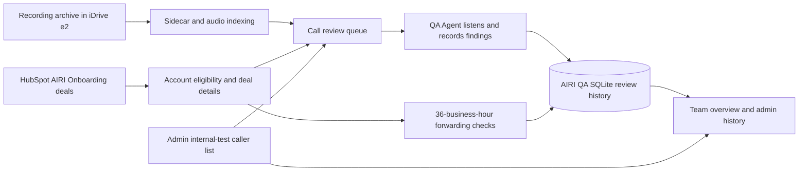

# AIRI QA Team Guide

**Audience:** AIRI QA Agents, QA admins, operations leads, trainers, and the team handling product bugs.

**Purpose:** Explain what AIRI QA does, how recordings and HubSpot data feed it, how to review calls safely, and how to train new teams. This is an operator guide, not a telephony or HubSpot configuration manual.

## What AIRI QA Does

AIRI QA indexes call recordings, gives QA Agents a shared queue, stores review decisions and feedback, and helps admins monitor review quality and forwarding tests. It does not make the call, change the AIRI bot, or determine whether an account should be onboarded.

At a high level:

## Access And Roles

- **AIRI QA Agent (`ai_bot_qc`):** Review calls, save review drafts, record outcomes, and complete forwarding checks. QA Agents do not have access to Team overview or admin settings.
- **AIRI QA admin (`ai_bot_qc_admin`):** QA Agent access plus Team overview, Team focus management, admin history, recording downloads, the shared internal-test caller list, and a read-only QA Agent preview.
- **Super admin:** Has AIRI QA admin access through the global administrator role.

The internal-test caller list is shared by all admins. It is not a personal preference list.

## How Recordings Enter The Queue

1. AIRI QA reads JSON sidecars and audio objects from the configured iDrive e2 bucket and archive prefix.
2. Sidecars are organized under account and date folders. Their `files[].location` entries are matched to audio objects in the same folder.
3. The sidecar supplies the recording identity and available call metadata: room name/ID, egress ID, start/end timestamps, and recording file references.
4. AIRI QA stores the call record, audio references, review state, and audit events in `ai-bot-qc.db`.
5. Opening AIRI QA syncs the archive before loading the queue. Use **Sync new recordings** to request a fresh sync.

These are AIRI/LiveKit recordings from the configured recording archive; this workflow is not attached to MiCC. The internal call ID identifies the indexed recording sidecar, while room and egress IDs identify recording sessions within this archive.

### Caller Number And Internal Test Calls

The recording sidecar itself does not provide a caller-number field. In this AIRI/LiveKit setup, numbered room names commonly follow `call-_+<number>_<token>`. AIRI QA extracts the number-shaped part as the caller ID (`From`) and normalizes it for matching. Room names such as `call-_anonymous_<token>` do not provide a number and remain unmatched.

The current LiveKit recording data does **not** provide a reliable called/destination number (`To`) or identify who ended a call. Do not infer `To` from the customer name, HubSpot phone fields, or the caller number. MiCC data is not part of this AIRI recording workflow.

Admins manage confirmed internal test numbers in **Admin settings → Internal test numbers**, with an optional label for each. Any call from a listed number is automatically flagged as an **Internal test call**, including earlier calls; removing the number removes the flag. Flagged calls are hidden from the Review queue by default and excluded from counts, reports, and forwarding checks. Use the queue's **Internal tests** filter (Hide, Include, Only) to see them. Only add a number when the team has confirmed it is an internal test caller. Nothing is deleted.

## HubSpot And Account Eligibility

- AIRI QA searches the HubSpot pipeline named **AIRI Onboarding** and matches recording-folder account names conservatively against deal name, company name, and account name.
- Matching tries normalized exact names first, then a unique token-subset match. Ambiguous names are not guessed.
- Deals in **Deadbeat Tried Service** and **WOOD** stages are treated as inactive when they can be matched. Their stage is not displayed in the QA Agent view.
- A missing or ambiguous match does not prove an account is inactive. Such calls can remain in the general review queue, but they cannot enter or complete the forwarding-test workflow, which requires a matched, active AIRI deal.
- The HubSpot record supplies the forwarding destination, main business phone, provider, and direct deal link used in forwarding checks. These are separate deal properties; an empty field is shown as not provided.
- HubSpot lookups are cached briefly. If the lookup fails, the review queue or forwarding view may report a verification error instead of silently treating unknown accounts as eligible.

If a valid account is missing from a HubSpot-linked workflow, ask an admin to verify the deal name/account fields and company association. Do not change the recording folder name just to force a match without checking the source record.

## Reviewing A Call

1. Open **Review queue**. Search by account, caller ID, date, or QA Agent; use the status filter and sortable column headings to narrow the list. Choose a call and check its account and time before listening.
2. Listen to the recording and assess what the bot said and how the interaction went. Use the current review form’s caller-happiness rating, structured caller flags, and notes where useful.
3. Save the review with a rating, a structured signal, QA Agent notes, or a critical issue detail. Critical issues require a written explanation and become follow-up work.
4. If a call is already claimed by someone else, coordinate with that QA Agent rather than duplicating the review. Claims expire after a short lease; drafts and changes are recorded in review history.
5. Admins may reopen a review when correction is needed. Reopening changes the review state; it does not erase the event history.

Use flags for observable call behavior, not guesses about caller intent. Keep notes factual, concise, and useful to the person who will follow up.

## Forwarding Checks

- An active, matched AIRI account becomes due after **36 business hours** without a new call. The business calendar is weekdays, 09:00–17:00 Eastern Time; weekends are excluded.
- QA Agents open **Forwarding checks**. Admins can also work from the due list in **Team overview**. Use the linked HubSpot deal and its phone/provider fields to identify the expected routing.
- Search the due list by account or phone, sort by the account details or quiet time, and filter recent completions by result. The recent-completions table is limited to the last 30 days.
- Place a test call, choose **Reached AIRI** or **Did not reach AIRI**, and save. Add a short note when it helps explain what was tested or what failed.
- **Did not reach AIRI** flags the associated call as critical and needs follow-up. If that call was already reviewed, it is returned to the unreviewed queue. An active QA Agent claim is preserved.
- Critical status belongs to that one call record, not the company forever. Clearing the critical flag on that call clears it; it does not alter other calls for the company.
- Recent completions show the checker, result, time, and note. Admins can reopen an incorrectly recorded check; reopening is audited.

## Team Overview And Admin Tools

- **Team overview** reports review counts, QA Agent activity, caller signals, caller happiness, account-level bot-health signals, forwarding tasks, and recent forwarding results. It is available to admins only.
- **Admin settings** is where admins add and individually remove shared Team focus posts, manage internal test numbers, and review audit history. Posts are retained rather than overwritten; QA Agents see the three newest unexpired posts, with the newest highlighted most strongly and posts from the last week marked NEW. The admin post list is paginated so older active posts remain manageable.
- **View as QA Agent** is a read-only preview for admins. It does not change the signed-in role, claim calls, save reviews, or grant access to another user.
- Internal test numbers are shared globally. Matching calls are flagged as Internal test calls, hidden from the queue by default (viewable with the Internal tests filter), and excluded from metrics, history, and forwarding checks; recordings stay playable and no review data is deleted.
- Admin history is searchable and sortable. Use it when investigating who changed a call, forwarding result, or other tracked item.
- Review metrics are for coaching and quality monitoring. Compare issue counts with reviewed sample size; do not use raw counts alone to rank call difficulty or penalize QA Agents.

## Bug Reporting And Triage

When reporting a problem, include:

- What you expected and what happened instead.
- The AIRI QA view and action involved.
- Account label, approximate call time with timezone, and whether the HubSpot deal link opens the expected deal.
- Whether the recording is missing, audio fails, a number is not detected, a result is not saved, or the wrong call is flagged.
- Safe reproduction steps and any visible error text.

Do not put caller phone numbers, credentials, tokens, full call transcripts, or downloaded recordings into general bug tickets. Use the approved restricted channel for sensitive evidence. Do not alter review state to work around an error; capture the call time/account and ask an admin to investigate.

### Quick Triage

| Symptom | First checks | Escalate when |
|---|---|---|
| Call is missing | Sync status, selected date/account, and whether its sidecar/audio exists in the expected archive folder | Sidecar exists but indexing or audio matching fails |
| Account is missing from a HubSpot-linked view | AIRI Onboarding pipeline, deal/company/account names, inactive stage, and ambiguity | A valid active deal cannot be matched conservatively |
| Caller number says not detected | Room-name format and whether it includes a number-shaped segment | The telephony source has a number but the room name does not |
| No destination number appears | Check HubSpot deal fields; recording metadata does not currently supply a dependable `To` number | HubSpot has the right value but AIRI QA is blank or stale |
| Forwarding test cannot save | Required result, latest-call freshness, 36-business-hour threshold, and active HubSpot match | All checks pass but save still fails |
| Critical flag appears after a failed forwarding test | Associated call ID, audit event, and critical filter | A different call is flagged or the active review claim changed |
| Queue or dashboard returns HubSpot verification error | Service health and HubSpot availability/permissions | Error persists; do not bypass eligibility checks manually |

## Training A Future Team

Use this sequence for a live walkthrough:

1. Explain the goal of AIRI QA and the difference between a recording, a call review, and a HubSpot deal.
2. Demonstrate the queue, opening and listening to one training-approved call, saving feedback, and recognizing an active claim.
3. Practice choosing caller signals and happiness ratings; ask trainees to explain why each flag is supported by what they heard.
4. Show the HubSpot link and the forwarding-check workflow. Use a safe test account to demonstrate both outcomes; explain that a failed outcome creates critical follow-up on one call.
5. Show admins the shared internal-test caller list and the effect of adding/removing a confirmed test number.
6. Have each trainee complete one supervised review and explain where they would report a missing recording, uncertain account match, or incorrect critical flag.
7. Before sign-off, confirm the trainee knows not to guess caller identity, destination numbers, or account eligibility.

Trainers should use approved sample calls, avoid displaying personal data to an unapproved audience, and check this guide against the deployed UI after material workflow changes.

## Data, Backups, And Limits

- Review state, forwarding results, exclusions, and audit events are stored in SQLite on the production server. Deployments preserve this database.
- A verified local AIRI QA database backup runs daily and retains 30 days of snapshots. An offsite backup destination is not currently established.
- Current recording sidecars do not identify who ended a call. A LiveKit call-event source would be needed; MiCC is not attached to these recordings.
- One known WOOD deal has not been safely associated with a recording-folder account. Do not claim that its calls are excluded unless the HubSpot association is corrected and the match is verified.
- HubSpot company read permissions are limited; account matching therefore relies on available deal properties and deliberately avoids ambiguous guesses.

## Keeping This Guide Current

This is the canonical AIRI QA team/trainer guide. When a workflow changes, update the relevant section here, validate it against the deployed UI and API behavior, and note the verification date in the change or training release notes. Keep README focused on repository setup and link to this guide instead of copying user instructions there.